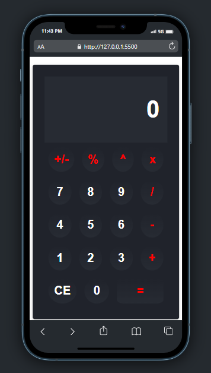

# Web-Calculator

Website kalkulator sederhana yang saya buat pada saat mengikuti pembelajaran di Dicoding - Kelas Belajar Dasar Pemograman Web - Alur Belajar Front-End Web Developer.
Dan sudah saya kembangkan sedikit dengan menambah beberapa fitur pada kalkulator serta mengubah UI dari kalkulator tersebut

[Demo](https://myweb-calculator.netlify.app/)

Dibuat dengan ❤ | Hizkia Reppi